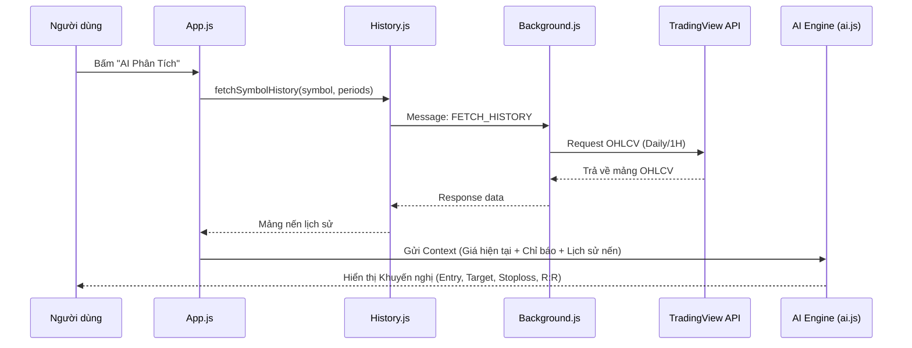

# System Architecture Overview: Trading Portfolio Pro

## 🏗️ Architecture Design
Ứng dụng được xây dựng theo mô hình **Chrome Extension Manifest v3**, sử dụng hệ thống **ES Modules (Vanilla JS)** để đảm bảo tính module và dễ bảo trì.

### 🧩 Core Components:
1.  **Popup UI (`ui.js`, `popup.html`, `style.css`)**: Giao diện chính của người dùng, quản lý render danh mục và cài đặt.
2.  **App Orchestrator (`app.js`)**: Trung tâm điều phối logic, kết nối UI với dữ liệu và AI.
3.  **Data Engine (`price.js`, `history.js`)**:
    *   `price.js`: Lấy giá thời gian thực và các chỉ báo kỹ thuật (Scanner API).
    *   `history.js`: Lấy dữ liệu nến lịch sử (OHLCV) phục vụ phân tích Price Action.
4.  **AI Engine (`ai.js`)**: Kết nối với Gemini/OpenAI để đưa ra các khuyến nghị đầu tư thông minh.
5.  **Background Processor (`background.js`)**: Chạy ngầm để theo dõi danh mục, gửi thông báo Telegram và làm Proxy vượt rào CORS cho các API bên ngoài.
6.  **Persistence Layer (`storage.js`)**: Trừu tượng hóa việc lưu trữ vào `chrome.storage.local`.

---

## 🌊 Data Flow (Swing Trading Intelligence)

Sơ đồ dưới đây mô tả cách hệ thống lấy dữ liệu và phân tích để đưa ra khuyến nghị lướt sóng:

---

## 🛠️ Security & Stability Patterns
*   **CORS Bypass**: Toàn bộ các yêu cầu `fetch` đến domain bên ngoài (TradingView, Google, OpenAI) đều được thực hiện thông qua `background.js` (Service Worker) để tránh lỗi Cross-Origin.
*   **Shadow DOM**: Cửa sổ chat AI nổi được bọc trong Shadow DOM để không bị ảnh hưởng bởi CSS của trang web mà người dùng đang truy cập.
*   **Minimal Intervention**: Các tính năng nâng cấp được xây dựng dưới dạng module mới (như `history.js`) để không gây lỗi cho các phần cũ đã chạy ổn định.
